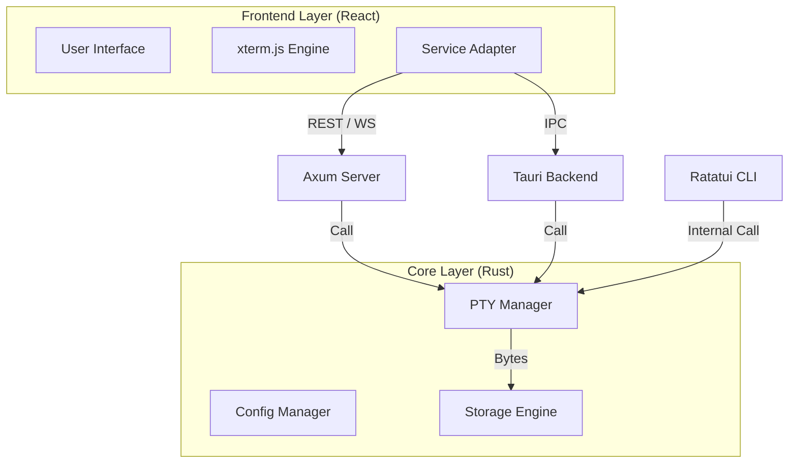

# CmdHub 开发设计方案书 (v1.0)

## 1. 项目概述

* **项目名称**：CmdHub
* **核心定位**：统一的跨平台命令行任务管理与执行中心。
* **适用场景**：
    * **桌面端 (Desktop)**：开发者本地脚本管理、参数化运行、日志归档。
    * **服务端 (Server/Web)**：远程服务器运维面板，提供浏览器端的任务管理与监控（类似 Cockpit）。
    * **终端 (CLI/TUI)**：SSH 环境下的快速交互式任务菜单（类似 k9s）。
* **核心技术栈**：
    * **后端/核心**：Rust (Core logic), Axum (Web Server), portable-pty (PTY manager).
    * **前端**：React, xterm.js (Terminal emulator).
    * **分发**：Tauri (Desktop), Ratatui (TUI).

---

## 2. 系统架构设计

系统采用 **分层架构**，通过 **适配器模式** 确保核心逻辑在不同运行环境下的高度复用。

### 2.1 项目目录结构 (Workspace)

```text
cmdhub/
├── Cargo.toml              # Workspace 定义
├── frontend/               # [前端] 通用 Web 前端 (React + xterm.js)
│   ├── src/
│   │   ├── services/       # 接口适配层 (Adapter: Tauri vs Web)
│   │   └── components/     # UI 组件 (Terminal, TaskList, Form)
├── core/                   # [Rust 库] 核心业务逻辑 (无 UI 依赖)
│   ├── src/
│   │   ├── config/         # 配置解析与模型 (TOML)
│   │   ├── pty/            # 伪终端生命周期管理
│   │   └── storage/        # 任务历史与日志持久化 (SQLite/JSON)
├── desktop/                # [Rust 二进制] Tauri 桌面端封装
│   ├── src-tauri/          # Tauri 后端指令集
├── server/                 # [Rust 二进制] Web 服务端 (Axum)
│   ├── src/
│   │   ├── api/            # RESTful API
│   │   └── ws/             # WebSocket 实时流转发
└── cli/                    # [Rust 二进制] 终端 UI (Ratatui)
```

### 2.2 架构数据流图



---

## 3. 核心模块详细设计

### 3.1 核心数据模型 (Core Models)

**任务定义 (`config.toml`) 示例**：
```toml
[[tasks]]
id = "build-project"
name = "构建项目"
command = "npm run build --env={{env}}"
cwd = "./project"
[tasks.inputs]
env = { type = "select", options = ["prod", "dev"], default = "dev" }
```

**Rust 数据结构 (`core/models.rs`)**:
```rust
pub struct Task {
    pub id: String,
    pub name: String,
    pub command: String,
    pub cwd: Option<PathBuf>,
    pub inputs: HashMap<String, InputConfig>,
}

pub enum InputConfig {
    Select { options: Vec<String>, default: String },
    Text { placeholder: String, default: String },
}
```

### 3.2 PTY 管理与流处理

* **生命周期**: 核心层负责 PTY 的创建、信号发送（Resize, Kill）及销毁。
* **流抽象**: 采用异步通道（Tokio MPSC）分发字节流，确保 I/O 非阻塞。
* **编码处理**: 统一使用 UTF-8 字符流，前端负责处理 ANSI 转义序列。

### 3.3 前端适配层 (Service Abstraction)

通过 TypeScript 接口屏蔽运行环境差异：
```typescript
interface ITaskService {
    listTasks(): Promise<Task[]>;
    executeTask(id: string, args: any): Promise<void>;
    onLog(callback: (data: string) => void): void;
}
```

---

## 4. 功能特性矩阵

| 功能点 | Desktop (GUI) | Server (Web) | CLI (TUI) |
| :--- | :---: | :---: | :---: |
| **任务编排与分组** | ✅ | ✅ | ✅ |
| **动态参数表单** | ✅ (可视化) | ✅ (可视化) | ✅ (交互式) |
| **实时终端模拟** | ✅ (xterm.js) | ✅ (xterm.js) | ✅ (Ratatui) |
| **任务历史追溯** | ✅ | ✅ | ✅ |
| **系统通知推送** | ✅ (原生) | ❌ | ❌ |
| **文件/路径选择** | ✅ (原生对话框) | ❌ (手动输入) | ✅ (补全) |

---

## 5. 开发路线图 (Roadmap)

### 阶段一：核心原型 (Week 1-2)
* **目标**：实现 PTY 封装与 CLI 基本交互。
* **交付物**：能够执行简单命令并输出到 Ratatui 界面的 CLI 程序。

### 阶段二：Web 平台与联调 (Week 3-4)
* **目标**：完成前端 React 框架与 Axum 后端对接。
* **交付物**：可通过浏览器远程运行服务器脚本的 Web 面板。

### 阶段三：桌面端增强 (Week 5-6)
* **目标**：集成 Tauri，实现本地原生功能（托盘、通知、文件对话框）。
* **交付物**：跨平台桌面安装包（.msi, .dmg, .deb）。

### 阶段四：完善与发布 (Week 7+)
* **目标**：安全审计、日志持久化、多语言支持。
* **交付物**：v1.0 正式版发布。

---

## 6. 技术难点与应对策略

1.  **多端 ANSI 解析一致性**：
    *   *对策*：Web/GUI 统一使用 `xterm.js`；TUI 端使用 `tui-term` 库，并建立统一的集成测试集验证转义码解析。
2.  **Web 模式安全风险**：
    *   *对策*：默认绑定 `127.0.0.1`；开启远程访问必须配置强 Token 认证；引入命令黑名单/白名单机制。
3.  **资源开销控制**：
    *   *对策*：在 Rust 层实现闲置 PTY 自动回收机制；限制单个任务的最大日志缓冲区大小。